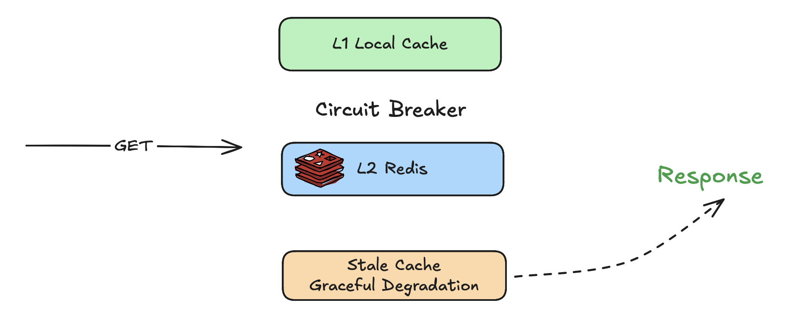

# Two-Level Caching in Go: Resilience, Fallbacks, and Failure Isolation



## The Architecture: L1 + L2

The core idea is straightforward. A GET request first checks the local in-memory L1 cache. On a hit, it returns immediately - no network all. On a miss, it falls through L2 (Redis). If Redis has the value, it writes it back to L1 for next time and returns. If both miss, you get an ErrCacheMiss.


```
Get("user:99")
    │
    ▼
┌────────┐  hit   ┌────────────┐
│ L1     │───────▶│ return     │
│ (local)│        └────────────┘
└───┬────┘
    │ miss
    ▼
┌────────┐  hit   ┌────────────┐
│ L2     │───────▶│ write to L1│──▶ return
│ (Redis)│        └────────────┘
└───┬────┘
    │ miss
    ▼
ErrCacheMiss
```

L1 is an in-proccess cache - no network round-trip, sub-microseconds reads. You pick between two backends:

- TinyLFU - admission-controlled eviction that keeps the most frequently used items. Best for high-cardinality key spaces.
- FreeCache - a lock-free, zero-GC cache. Best for raw throughput.

L2 is Redis, accessed via go-redis. It acts as the shared, durable layer across multiple instances of your service.

## The Problem: What Happens When Redis Dies?

With a naive two-level cache, here's the failure sequence:

1. L1 entry expires (TTL is typically short — 1 minute).
2. Get falls through to Redis.
3. Redis is down. Connection timeout. Error returned to the caller.
4. Your API returns a 500.
5. Every subsequent request for that key repeats steps 2–4.

## Layer 1: Circuit Breaker

The first defense is a circuit breaker, implemented with [gobreaker](https://github.com/sony/gobreaker)

```go
c, err := cache.New("my-service",
  cache.WithRedisConn(redisClient, 5*time.Minute),
  cache.WithLocalCacheTinyLFU(10000, time.Minute),
  cache.WithCBEnabled(true),
)
```

The circuit breaker has three states:

- **Closed** - normal operation, requests flow to Redis.
- **Open** - after N consecutive failures (default: 2), all Redis calls are short-circuited. Set silently falls back to L1-only. Get returns the error without hitting the network.
- **Half-open** — after a timeout (default: 4 minutes), one probe request is sent to Redis. If it succeeds, the breaker closes.

This prevents your service from hammering a dead Redis and speeds up failure detection. But Get still returns an error when both L1 has expired and the breaker is open.

## Layer 2: Graceful Degradation with a Stale Cache

This is where it gets interesting. The idea: maintain a second in-memory cache (the "stale cache") with a much longer TTL. Every write goes to both the primary L1 and the stale cache. The stale cache is only consulted when Redis is unavailable.

```
c, err := cache.New("my-service",
  cache.WithRedisConn(redisClient, 5*time.Minute),
  cache.WithLocalCacheTinyLFU(10000, time.Minute),
  cache.WithCBEnabled(true),
  cache.WithGracefulDegradation(1*time.Hour),
)
```

The flow on a Redis error now becomes:

```
L1 miss + Redis error
    │
    ▼
┌────────────┐  hit   ┌─────────────────┐
│ Stale cache│───────▶│ return stale data│
└───┬────────┘        └─────────────────┘
    │ miss
    ▼
return error
```

When L1 misses and Redis returns an error, the stale cache is checked. If it has the data, it's returned. If not, the error propagates.

The stale cache is consulted on any Redis error — not just when the circuit breaker is open. This means even the first Redis failure (before the breaker trips) can be recovered from. The only case where the stale cache is not consulted is redis.Nil — a genuine cache miss means the key was never written, so there's no stale data to return.

> Setting staleTTL to 0 means stale entries never expire — they're only evicted when the TinyLFU cache is full (default 10k items, configurable via a second argument).

## Layer 3: Cache Preloading

The final piece: what if Redis has never been reachable? Cold start, first deployment, or a Redis cluster that hasn't come up yet. Even the stale cache is empty.

WithPreload warms up both L1 and the stale cache at construction time:

```go
fallback := map[string][]byte{
  "config": []byte(`{"feature_x":false}`),
}
c, err := cache.New("my-service",
  cache.WithRedisConn(redisClient, 5*time.Minute),
  cache.WithLocalCacheTinyLFU(10000, time.Minute),
  cache.WithCBEnabled(true),
  cache.WithGracefulDegradation(0),
  cache.WithPreload(fallback),
)
```

Preloaded data is written to L1 and the stale cache (if configured). Redis is not touched.

## Putting It All Together: Maximum Resiliency

Here's what happens at runtime with the full configuration:

1. Normal operation — Get("config") hits L1 or Redis as usual.
2. L1 expires, Redis healthy — value is fetched from Redis and written back to L1.
3. Redis goes down, L1 still fresh — L1 hit, no error.
4. Redis down, L1 expired — stale cache returns the last known value.
5. Redis has never been reachable — the preloaded fallback (never-expiring) is returned.

Your service always returns data. It might be stale, but it's data — and that's almost always better than a 500.


