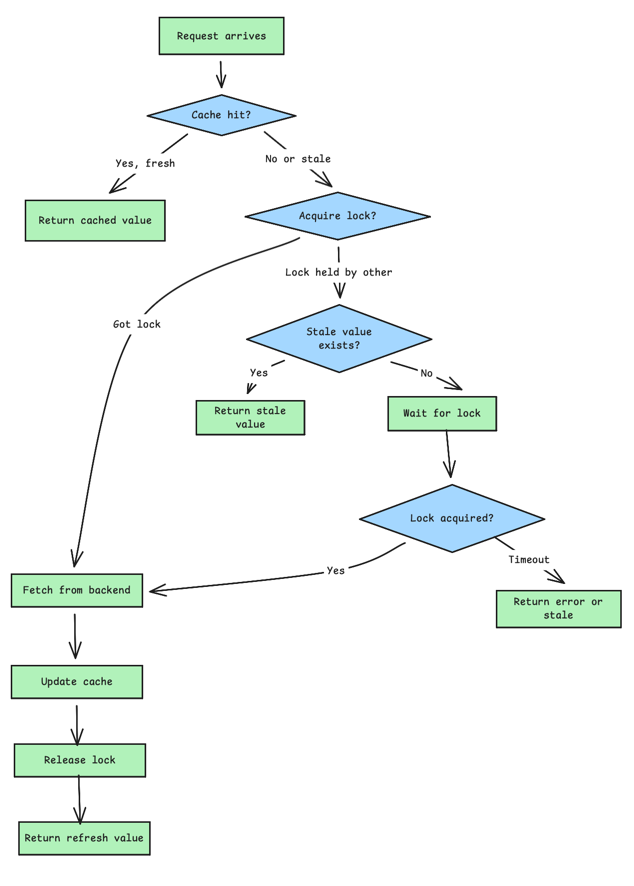
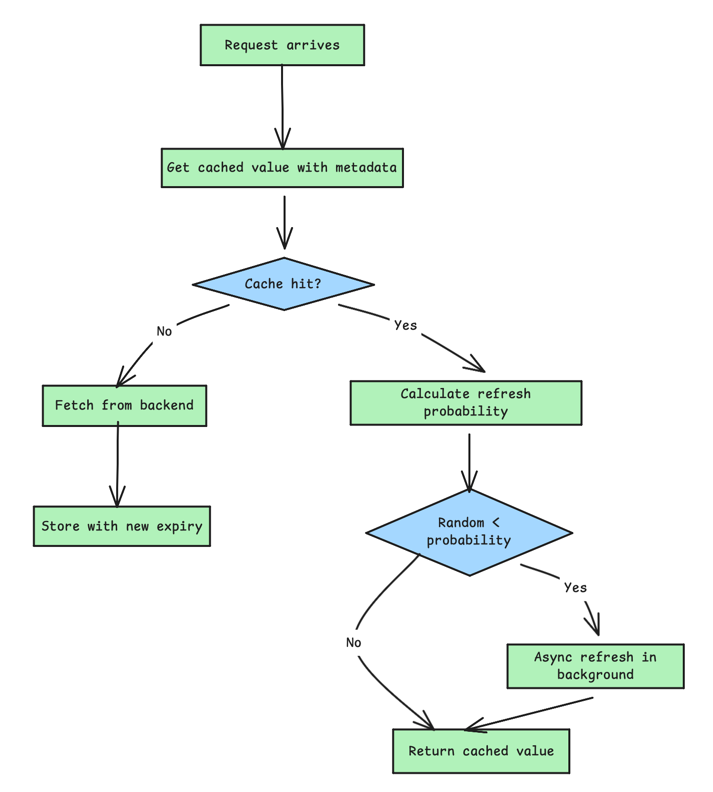
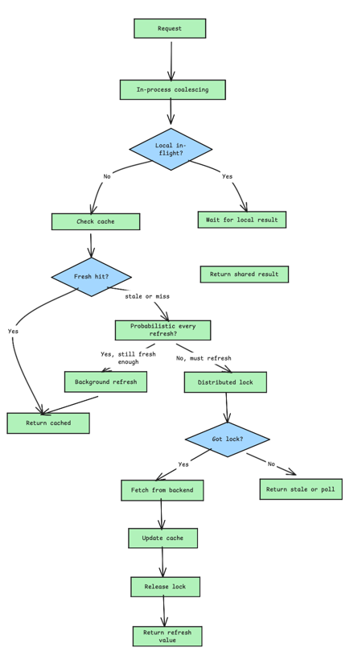
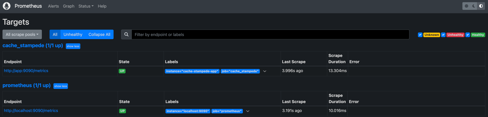
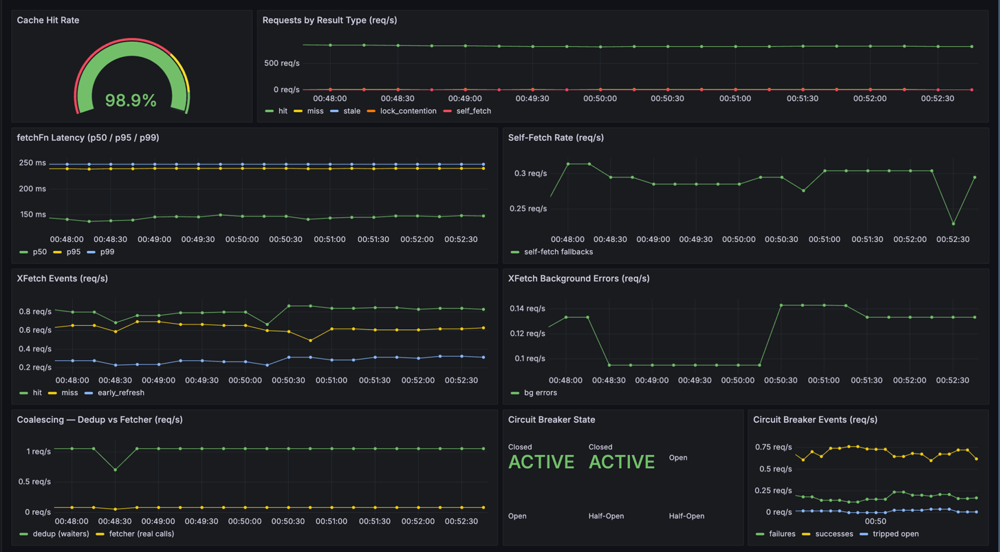

# How to Build Cache Stampede Prevention

## What is Cache Stampede?

Cache Stampede, also known as the thundering herd problem, is one of the most dangerous failure scenarios in distributed
systems. It occurs when a cache entry expires and many concurrent requests try to recompute the same value simultaneously.
Instead of a single smooth refresh, the backend gets overwhelmed by a sudden surge of identical requests.

### Why This Happens

- **High traffic to single key:** More requests hit during the vulnerable window
- **Slow backend computation:** Longer window means more piled-up requests
- **Synchronized expiration:** Multiple keys expiring together multiply the effect.
- **Cold cache on deploy:** All keys are empty simultaneously

## Locking Strategies

The most direct solution is to ensure only one request recomputes the cache while others wait. This prevents duplicate 
backend work at the cost of some coordination overhead.

### Distributed Lock with Fallback to Stale Data



### Lock Considerations

When implementing distributed locks for cache stampede prevention, keep these points in mind:

- **Lock timeout must exceed computation time:** If your backend query take 2 seconds, a 1-second lock timeout will cause the 
lock to expire mid-computation, allowing another request to start duplicate work.
- **Use atomic lock acquisition:** The `SET key value EX timeout NX` pattern in Redis is atomic and prevents race conditions. Avoid
separate `SETNX` and `EXPIRE` calls.
- **Always release locks in a finally block:** If your computation throws an exception, the lock must still be released. Otherwise,
other requests will wait until the lock times out.
- **Handle lock holder crashes:** The lock timeout serves as a safety net. If the process holding the lock crashes, the lock will eventually
expire and allow another request to proceed.

## Probabilistic Early Recomputation

Instead of waiting for a cache key to expire, you can proactively recompute it before expiration. The probabilistic 
approach adds randomness to prevent synchronized refreshes across a cluster.

### XFetch Algorithm

The XFetch algorithm, documented by Vattani et al. in their paper on optimal cache stampede prevention, uses an exponential 
distribution to decide when to refresh. As a cache entry approaches expiration, the probability of refreshing increases.



The probability formula considers time remaining until expiration and a tunable parameter beta:

```text
probability = exp(-beta * (expiry - now) / delta)
```

**Where:**

- `expiry` is when the cache entry expires
- `now` is the current time
- `delta` is the computation time for the cached value
- `beta` controls how aggressive the early recomputation is

### Tuning the Beta Parameter

The beta parameter controls how early the recomputation starts:

- **0.5:** Very aggressive, starts refreshing early
- **1.0:** Balanced, recommended starting point
- **2.0:** Conservative, waits longer before refreshing

Lower beta values reduce stampede risk but increase backend load during normal operation. Higher values are more efficient but leave a smaller safety margin.

## Request Coalescing

Request coalescing, also called single-flight or deduplication, ensures that multiple simultaneous requests for the same 
key share a single backend computation. Instead of each request triggering its own query, they all wait for the result of 
a single in-progress request.

### In-Process Request Coalescing

For a single process, you can use a simple in-memory map to track in-flight requests. This is simple and effective but only
works within a single process. In a multi-instance deployment, each instance maintains its own in-flight map, so requests to different
instances will still trigger duplicate backend queries.

### Distributed Request Coalescing

For true distributed coalescing, combine the in-process coalescer with a distributed lock

## Combining Strategies

In production systems, you often combine multiple strategies for defense in depth. Here is a recommended layered approach



## Monitoring and Alerting

Stampede prevention mechanisms can mask underlying issues. Monitor these metrics to catch problems before they escalate:

- **Lock acquisition rate:** High contention suggests cache is expiring too often
- **Stale data serve rate:** Frequent stale responses mean backend is too slow
- **Background refresh failures:** Persistent failures indicate backend problems
- **Cache hit ratio:** Sudden drops suggest invalidation storms
- **Lock timeout events:** Indicates computation time exceeds lock timeout

**Set up alerts for:**

1. Lock acquisition failures exceeding 10% of requests
2. More than 5% of requests receiving stale data
3. Background refresh error rate above 1%
4. Sudden drop in cache hit ratio by more than 20%




## Common Pitfalls

- **Forgetting about cold starts:** When you deploy a new version or scale up new instances, the cache is empty. Use cache warning
or coordinate deployments to avoid simultaneous cold cache scenarios.
- **Setting TTL too short:** Very short TTLs increase the frequency of potential stampedes. Balance freshness requirements against stability.
- **Not handling lock holder failures:** If the process holding the lock crashes, others might wait indefinitely. Always use lock timeouts
and handle the timeout case gracefully.
- **Ignoring clock skew:** In distributed systems, clock skew can cause early expiration calculations to behave unexpectedly. Use relative times
where possible.
- **Over-engineering for low-traffic keys:** Not every cache key needs stampede protection. Focus on high-traffic, expensive-to-compute keys.

## References
1. [How to Build Cache Stampede Prevention](https://oneuptime.com/blog/post/2026-01-30-cache-stampede-prevention/view)
2. [XFetch Algorithm](https://www.vldb.org/pvldb/vol8/p886-vattani.pdf)
