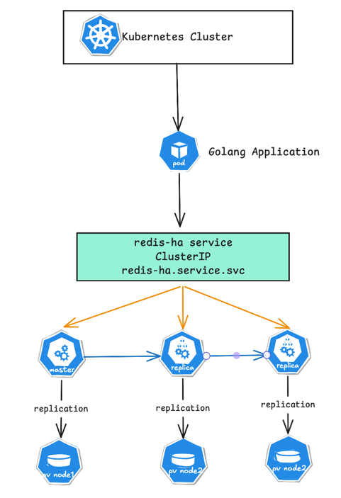
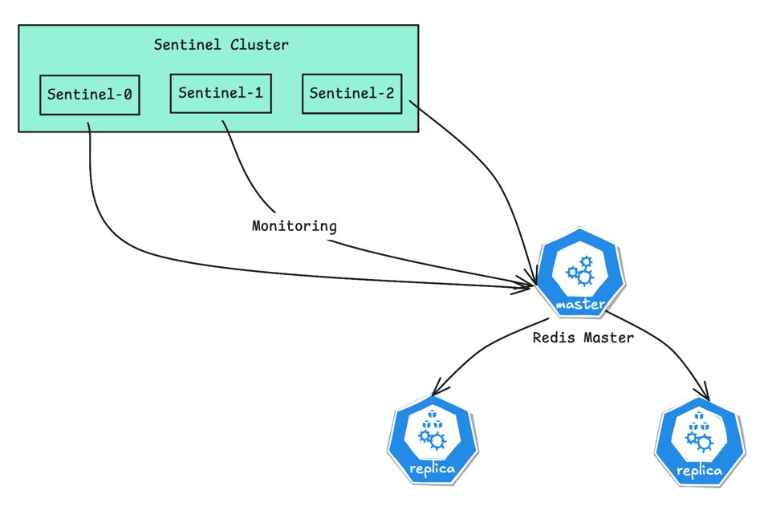

# Redis High Availability in Kubernetes: Sentinel Architecture, Failover, and Golang Integration

## 1. Overview

The architecture includes:

-   Redis replication
-   Automatic failover using Sentinel
-   Persistent storage using PV/PVC
-   Kubernetes service routing
-   Application connectivity using Golang

## 2. High Level Architecture



## 3. Redis Sentinel Architecture

Each Redis pod runs:

-   Redis server
-   Sentinel process



## 4. Storage Architecture

Redis requires persistent storage. Kubernetes storage flow:

```
Redis Pod
   │
   ▼
PersistentVolumeClaim
   │
   ▼
PersistentVolume
   │
   ▼
HostPath Storage or NFS or EBS
```

Example directories:

```
/data/redis/node0
/data/redis/node1
/data/redis/node2
```

## 5. Create StorageClass

```yaml
apiVersion: storage.k8s.io/v1
kind: StorageClass
metadata:
  name: redis-static
provisioner: kubernetes.io/no-provisioner
volumeBindingMode: WaitForFirstConsumer
```

Apply:

```bash
kubectl apply -f storageclass.yaml
```

### Redis Directory Permissions Requirement

Since Redis runs with **UID `1001`**, the Redis data directories must be owned by that user.

#### 1. Set Directory Ownership

Apply the correct ownership:

```bash
sudo chown -R 1001:1001 /data/redis
```

#### 2. Set Directory Permissions

Set appropriate permissions:

```bash
sudo chmod -R 755 /data/redis
```

**Why This Is Required**

Bitnami containers follow Kubernetes **security best practices**:

```bash
runAsUser: 1001
runAsNonRoot: true
```

Because of this:

-   Redis **cannot write to directories owned by `root`**
-   Incorrect permissions cause **Redis startup failures**
-   Persistent storage becomes **unusable for Redis**

## 6. Create Persistent Volumes

Three PVs are required because there are **three Redis pods**.

```yaml
apiVersion: v1
kind: PersistentVolume
metadata:
  name: redis-pv-0
spec:
  capacity:
    storage: 5Gi
  accessModes:
    - ReadWriteOnce
  storageClassName: redis-static
  persistentVolumeReclaimPolicy: Retain
  hostPath:
    path: /data/redis/node0
---
apiVersion: v1
kind: PersistentVolume
metadata:
  name: redis-pv-1
spec:
  capacity:
    storage: 5Gi
  accessModes:
    - ReadWriteOnce
  storageClassName: redis-static
  persistentVolumeReclaimPolicy: Retain
  hostPath:
    path: /data/redis/node1
---
apiVersion: v1
kind: PersistentVolume
metadata:
  name: redis-pv-2
spec:
  capacity:
    storage: 5Gi
  accessModes:
    - ReadWriteOnce
  storageClassName: redis-static
  persistentVolumeReclaimPolicy: Retain
  hostPath:
    path: /data/redis/node2
```

Apply:

```bash
kubectl apply -f redis-pv.yaml
```

Verify:

```bash
kubectl get pv
```

## 7. Deploy Redis using Helm

Add Bitnami repository

```bash
helm repo add bitnami https://charts.bitnami.com/bitnami
helm repo update
```

Create a Redis namespace

```bash
kubectl create namespace redis
```

## 8. Redis Values Configuration

```yaml
architecture: replication
auth:
  enabled: true
  password: StrongPassword123
master:
  persistence:
    enabled: true
    storageClass: redis-static
    size: 5Gi
resources:
    requests:
      cpu: 250m
      memory: 512Mi
    limits:
      cpu: 500m
      memory: 1Gi
configuration: |-
    maxmemory 800mb
    maxmemory-policy allkeys-lru
replica:
  replicaCount: 3
persistence:
    enabled: true
    storageClass: redis-static
    size: 5Gi
resources:
    requests:
      cpu: 250m
      memory: 512Mi
    limits:
      cpu: 500m
      memory: 1Gi
configuration: |-
    maxmemory 900mb
    maxmemory-policy allkeys-lru
sentinel:
  enabled: true
  quorum: 2
resources:
    requests:
      cpu: 100m
      memory: 128Mi
    limits:
      cpu: 200m
      memory: 256Mi
startupProbe:
    enabled: false
service:
    type: NodePort
    nodePorts:
      redis: "30013"
      sentinel: "30021"
```

## 9. Install Redis

```bash
helm install redis-ha bitnami/redis 
-n redis 
-f values.yaml
```

## 10. Verify Deployment

```bash
kubectl get pods -n redis

## Output
redis-ha-node-0
redis-ha-node-1
redis-ha-node-2
```

Check services.

```bash
kubectl get svc -n redis

## Output
redis-ha
redis-ha-headless
```

## 11. Failover Process

When the master fails:

```
Master failure
      │
      ▼
Sentinel detects failure
      │
      ▼
SDOWN (subjectively down)
      │
      ▼
Quorum reached
      │
      ▼
ODOWN
      │
      ▼
Leader Sentinel elected
      │
      ▼
Replica promoted to master
      │
      ▼
Service routes traffic to new master
```

Typical failover time:

```bash
3 – 10 seconds
```

## 13. Kubernetes Networking Flow

```
Application Pod
      │
      ▼
redis-ha.redis.svc.cluster.local
      │
      ▼
Kubernetes Service
      │
      ▼
Current Redis Master Pod
```