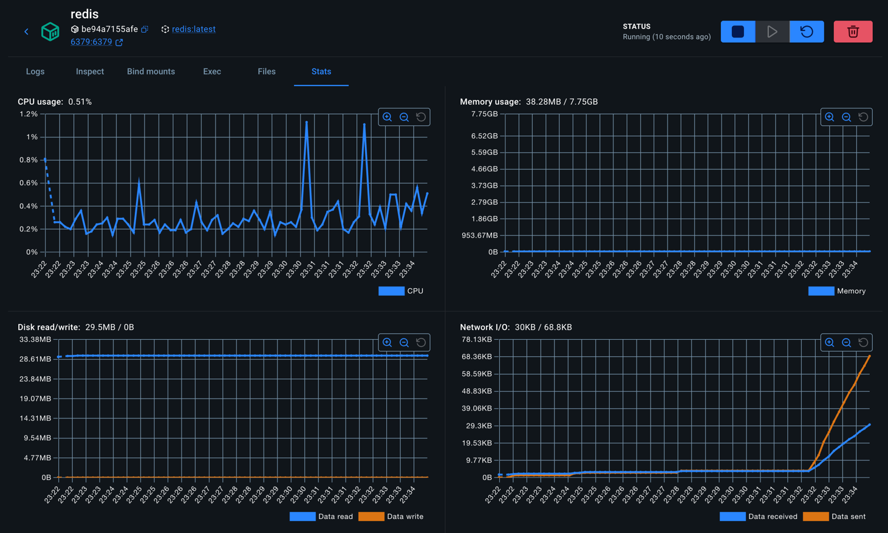

# How to Monitor Redis Persistence Performance

> Monitor Redis RDB and AOF persistence health using INFO persistence metrics, latency tracking, and alerting to catch problems before they cause data loss.

Redis persistence - both RDB snapshots and AOF - can fail silently or degrade performance without obvious errors. 
Regular monitoring of persistence metrics helps you catch issues before they cause data loss or availability problems.

## Key Metrics from INFO persistence

```bash
redis-cli INFO persistence

# Persistence
loading:0
async_loading:0
current_cow_peak:0
current_cow_size:0
current_cow_size_age:0
current_fork_perc:0.00
current_save_keys_processed:0
current_save_keys_total:0
rdb_changes_since_last_save:0
rdb_bgsave_in_progress:0
rdb_last_save_time:1777738943
rdb_last_bgsave_status:ok
rdb_last_bgsave_time_sec:-1
rdb_current_bgsave_time_sec:-1
rdb_saves:0
rdb_saves_consecutive_failures:0
rdb_last_cow_size:0
rdb_last_load_keys_expired:0
rdb_last_load_keys_loaded:0
aof_enabled:0
aof_rewrite_in_progress:0
aof_rewrite_scheduled:0
aof_last_rewrite_time_sec:-1
aof_current_rewrite_time_sec:-1
aof_last_bgrewrite_status:ok
aof_rewrites:0
aof_rewrites_consecutive_failures:0
aof_last_write_status:ok
aof_last_cow_size:0
module_fork_in_progress:0
module_fork_last_cow_size:0
```

## Monitoring Save Duration

Long BGSAVE durations indicate disk contention or large datasets:

```bash
redis-cli INFO persistence | grep rdb_last_bgsave_time_sec
```

Track this over time. If BGSAVE duration starts increasing without a corresponding dataset size increase, investigate disk I/O:

```bash
iostat -x 1 5
```

## Monitoring Copy-on-Write Overhead

Long BGSAVE durations indicate disk contention or large datasets:

```bash
redis-cli INFO persistence | grep rdb_last_bgsave_time_sec
```

Track this over time. If BGSAVE duration starts increasing without a corresponding dataset size increase, investigate disk I/O:

```bash
iostat -x 1 5
```

## Monitoring Copy-on-Write Overhead

```bash
redis-cli INFO persistence | grep rdb_last_cow_size
```

High COW overhead means many writes are occurring during snapshots. In bytes:
- `< 100 MB`: normal
- `100 MB - 500 MB`: elevated, consider scheduling saves during off-peak hours
> `500 MB:` problematic, investigate write rate or dataset size

## AOF Buffer Monitoring

```bash
watch -n 2 "redis-cli INFO persistence | grep -E 'aof_buffer|aof_rewrite_buffer|aof_pending'"
```

`aof_rewrite_buffer_length` growing continuously means the rewrite child cannot keep up with incoming writes. Check:

```bash
redis-cli INFO stats | grep instantaneous_ops_per_sec
```

## Using Redis Latency Monitoring

Enable latency tracking for persistence events:

```bash
redis-cli CONFIG SET latency-monitor-threshold 100
redis-cli LATENCY LATEST
```

## Prometheus Metrics Export

```text
redis_rdb_last_bgsave_status{...} 1
redis_rdb_last_save_timestamp_seconds{...} 1.7119e+09
redis_rdb_last_bgsave_duration_sec{...} 3
redis_aof_enabled{...} 1
redis_aof_current_size_bytes{...} 1.34e+08
redis_aof_delayed_fsync_total{...} 0
```



## Reference

1. [How to Monitor Redis Persistence Performance](https://oneuptime.com/blog/post/2026-03-31-redis-monitor-persistence-performance/view#:~:text=Monitor%20Redis%20persistence%20health%20by,with%20application%20response%20time%20degradation.)