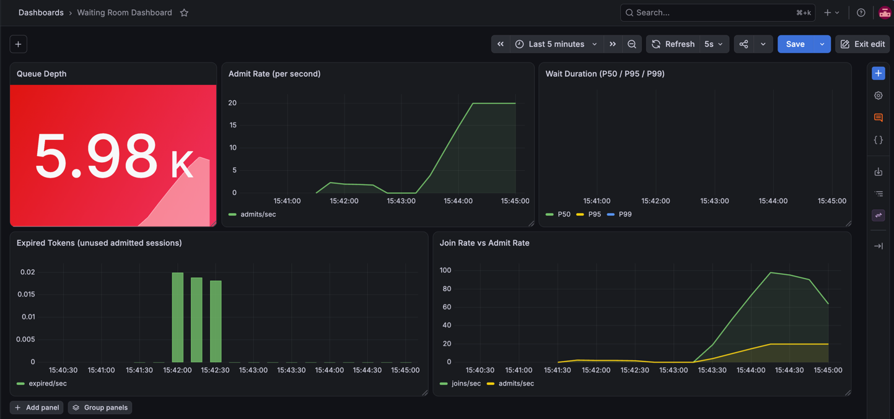

# Waiting Room in Go: Controlled Admission Under Traffic Spikes

A Waiting Room (also called a _virtual queue_ or _traffic shaping queue_) is a pattern that protects a resource from
being overwhelmed by letting users in at a controlled rate. Instead of returning `429 Too Many Requests` or crashing,
the server enqueues excess sessions and admits them when capacity is available.

## The Problem

Flash sales, ticket drops, and sudden viral traffic all share the same failure mode: a resource that handles 50
requests/sec gets hit by 5,000 simultaneously. Common responses — rate limiting, queuing at the load balancer, or
horizontal scaling — either reject users outright or are too slow to spin up in time.

A waiting room shifts the problem: instead of dropping traffic, it absorbs it into an ordered queue and drains it at a
rate the backend can sustain. Users see their queue position rather than an error page.

## Architecture

```
Client
  |
  v
POST /queue/join  ──────────────────────────────────────────┐
  |                                                          |
  v                                                          v
[RedisQueue]  (ZADD waiting-room:queue NX <ts> <sessionID>) |
  |                                                          |
  |   background ticker (every 500ms)                        |
  |        |                                                 |
  |        v                                                 |
  |   [Admitter] ── ZPOPMIN N ──> SET admitted:<id> EX 300  |
  |                                                          |
  v                                                          |
GET /queue/status  ─── ZRANK ──────────────────────────────>|
  |                                                          |
  v                                                          |
GET /resource  ───── check admitted:<id> ──────────────────>|
                      one-time token consumed on entry
```

## Project Structure

```
waiting-room/
├── cmd/
│   └── server/
│       └── main.go                 # Server entrypoint, wires all components
├── internal/
│   ├── queue/
│   │   ├── queue.go                # Queue interface
│   │   └── redis_queue.go          # Redis sorted-set implementation
│   ├── admission/
│   │   └── admitter.go             # Ticker-based admission loop + Prometheus metrics
│   └── handler/
│       └── handler.go              # HTTP handlers: join, status, resource
├── pkg/
│   └── middleware/
│       └── waiting_room.go         # Optional middleware for protecting any handler
├── grafana/
│   └── dashboard.json              # Pre-built Grafana dashboard
├── prometheus.yaml                 # Prometheus scrape configuration
├── docker-compose.yaml             # Full stack: app, redis, prometheus, grafana
├── Dockerfile                      # Multi-stage Go build
└── loadtest.sh                     # Load test script
```

## How It Works

### Session Lifecycle

```
[Join] ──> WAITING ──> (admitted by ticker) ──> ADMITTED ──> [Access resource] ──> DONE
                                                                  |
                                                          TTL expires (5 min)
                                                                  |
                                                               EXPIRED
```

### Queue — Redis Sorted Set

The queue is backed by a Redis sorted set where the **score is the Unix nanosecond timestamp** at join time. This gives
natural FIFO ordering and atomic batch admission.

| Operation | Redis Command |
|---|---|
| Enqueue | `ZADD waiting-room:queue NX <ts> <sessionID>` |
| Get position | `ZRANK waiting-room:queue <sessionID>` |
| Admit N | `ZPOPMIN waiting-room:queue N` |
| Queue depth | `ZCARD waiting-room:queue` |

### Admitter — Ticker Loop

A background goroutine ticks every 500 ms and calls `ZPOPMIN N` to atomically dequeue the oldest N sessions, then
writes `SET admitted:<sessionID> 1 EX 300` for each one. Effective admit rate = `N / tick`.

```go
// Simplified flow inside admitter
ids, _ := queue.Admit(ctx, rate)          // ZPOPMIN rate
for _, id := range ids {
    redis.SetEx(ctx, "admitted:"+id, "1", 5*time.Minute)
}
```

### HTTP Endpoints

| Method | Path | Description |
|---|---|---|
| `POST` | `/queue/join` | Enqueue caller, return `session_id`, position, and ETA |
| `GET` | `/queue/status?session_id=X` | Poll position or detect admission |
| `GET` | `/resource?session_id=X` | Protected resource — one-time entry for admitted sessions |

**Join response:**
```json
{ "session_id": "uuid", "position": 42, "estimated_wait_ms": 4200 }
```

**Status response (waiting):**
```json
{ "admitted": false, "position": 3 }
```

**Status response (ready):**
```json
{ "admitted": true }
```

## Getting Started

### Prerequisites

- Go 1.21+
- Docker and Docker Compose

### Run

```bash
cd waiting-room
docker compose up --build -d
```

| Service | Port | Description |
|---|---|---|
| server | 8080 | Go waiting-room service |
| redis | 6379 | Queue and admitted-set store |
| prometheus | 9090 | Metrics scraping |
| grafana | 3000 | Dashboard (admin/admin) |

### Test Manually

```bash
# 1. Join the queue
curl -s -X POST http://localhost:8080/queue/join | jq .

# 2. Poll status (replace <SESSION_ID>)
curl -s "http://localhost:8080/queue/status?session_id=<SESSION_ID>" | jq .

# 3. Access the resource once admitted
curl -s "http://localhost:8080/resource?session_id=<SESSION_ID>" | jq .
```

### Load Test

```bash
chmod +x loadtest.sh
./loadtest.sh

# override defaults
TOTAL_USERS=500 ./loadtest.sh
```

## Monitoring

The project includes a pre-configured Grafana dashboard with four panels:

| Panel | Metric | Description |
|---|---|---|
| Queue Depth | `waiting_room_queue_depth` | Current sessions waiting in queue |
| Admit Rate | `waiting_room_admit_total` | Sessions admitted per second |
| Wait Duration (P95) | `waiting_room_wait_duration_ms` | Time from join to admission |
| Expired Tokens | `waiting_room_expired_total` | Admitted tokens that were never used |

Open Grafana at [http://localhost:3000](http://localhost:3000) (admin/admin) and navigate to the **Waiting Room Dashboard**.



## Load Test Results

Running `./loadtest.sh` with 100 concurrent users against an admit rate of 20/sec:

| Metric | Value | Insight |
|---|---|---|
| Total users | 100 | All joined simultaneously |
| Time to full admission | ~5s | 20 admits/sec × 5 ticks |
| Resource success rate | 100% | No admitted session rejected |
| Token replay rejections | 100% | One-time use enforced correctly |

## Trade-offs

| Trade-off | Detail |
|---|---|
| **Client-driven polling** | Status is polled by the client (GET every N seconds). Simpler than SSE/WebSocket but adds latency between admission and client awareness. Use SSE for a smoother UX. |
| **Admitted token TTL** | Sessions must access the resource before the TTL (default 5 min) expires, or they lose their spot without re-queuing. Tune TTL to your expected user flow time. |
| **Single Redis node** | The queue and admitted set live in one Redis instance. For production, use Redis Sentinel or Cluster — see [`redis-high-availability/`](../redis-high-availability/). |
| **No fairness across restarts** | If the server restarts, the admitter resumes from the queue state in Redis. In-memory rate counters reset, which can cause a brief burst of admissions. |
